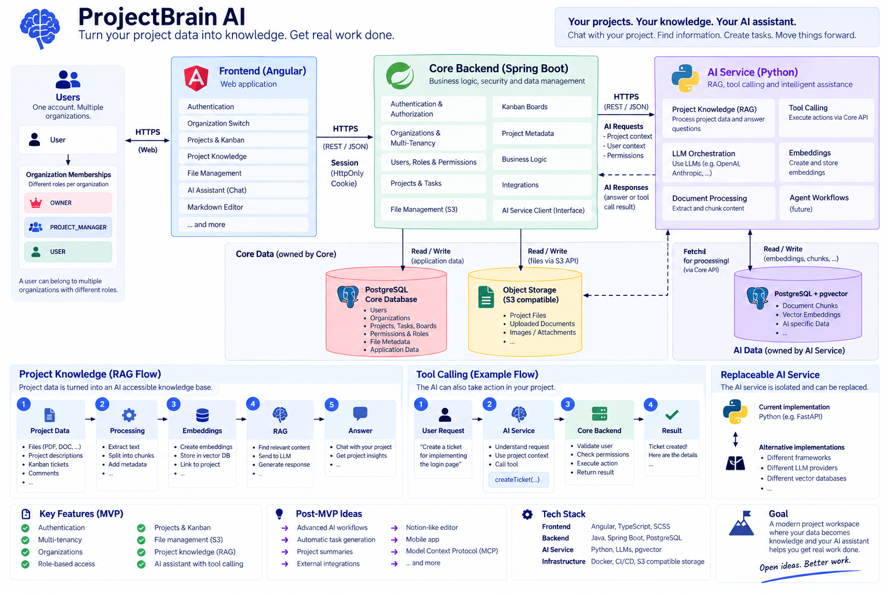

# ProjectBrain AI 🧠

> 🚧 **Project Status: Early Development**
>
> ProjectBrain AI is currently in early development. The architecture and features described here show the current idea for the project and can change while I build and learn more about the different technologies.

**ProjectBrain AI** is an AI powered, multi tenant project workspace.

The main idea is to turn project data into useful knowledge for the AI. Files, project descriptions, documentation and tasks can become part of a project specific knowledge base. This should make it possible to talk with the AI about the actual project instead of using a chatbot without project context.

The AI should not only answer questions. In a later step it should also be able to interact with the application through tool calling. For example, a user could ask the AI to create a new task or update an existing one.

Classic project management features like organizations, projects, Kanban boards, roles and file management build the foundation for this.

The project is also a practical learning project for me to improve my knowledge of Spring Boot, Angular, software architecture and AI application development.

---

## 🏗️ Architecture



ProjectBrain AI is currently planned around three main applications.

### 🅰️ Angular Frontend

The frontend is the main application for the user.

It will include:

* Authentication
* Organization and team management
* Projects
* Kanban boards
* File management
* Project knowledge
* AI features

### ☕ Spring Boot Core Backend

The Spring Boot backend is responsible for the main business logic and application data.

It will handle:

* Authentication and authorization
* Users
* Organizations and multi tenancy
* Roles and permissions
* Projects
* Kanban boards and tasks
* File information
* Business rules
* Core application data

The core application uses **PostgreSQL** as its main database.

### 🐍 Python AI Application

A separate Python application is planned for the AI part of ProjectBrain.

The current ideas include:

* LLM integration
* Retrieval Augmented Generation (RAG)
* Project specific AI context
* Embeddings
* Semantic search
* Tool calling
* Agent workflows

AI related knowledge and embeddings are planned to be stored separately from the normal application data, for example with **PostgreSQL and pgvector**.

The exact implementation is not fixed yet. Part of this project is to learn more about these technologies and find a good solution while building the application.

---

## 🧠 Project Knowledge

One of the main features of ProjectBrain AI is the project specific knowledge base.

A project can contain information from different sources, for example:

* Uploaded files
* Project descriptions
* Documentation
* Kanban tasks
* Task descriptions
* Other project related content

Relevant content can later be processed and split into smaller parts. Embeddings can then be created from this content and stored for semantic search.

With Retrieval Augmented Generation, the AI can search for relevant project information before answering a question.

This should make conversations like these possible:

> "What did we decide about authentication?"

> "Can you summarize the requirements from the uploaded specification?"

> "Which open tasks are related to the payment integration?"

> "What does the project documentation say about user permissions?"

The goal is that the AI can understand the context of a project based on the information that is actually available inside ProjectBrain.

A simplified idea of the flow looks like this:

```text
Project
  │
  ├── Files
  ├── Documentation
  ├── Project Description
  └── Tasks
        │
        ▼
Content Processing
        │
        ▼
Embeddings
        │
        ▼
Vector Search
        │
        ▼
RAG
        │
        ▼
AI with Project Context
```

The details of this process, such as chunking strategies, embedding models and retrieval methods, will be explored during development.

---

## 🤖 AI and Tool Calling

ProjectBrain AI should not only understand project information. The AI should also be able to perform actions through defined tools.

For example, a user could write:

> "Create a task for implementing the login page."

A simplified flow could look like this:

```text
User
 │
 ▼
AI Application
 │
 │ Tool Call
 ▼
Spring Boot Core Backend
 │
 ├── Check user
 ├── Check organization
 ├── Check permissions
 │
 ▼
Create Task
```

The Spring Boot backend stays responsible for business rules and permissions.

The AI can request an action, but the Core Backend decides if the action is allowed and performs the actual change.

This could later connect project knowledge and actions.

For example:

```text
"Read the uploaded requirements and create the required tasks."
                         │
                         ▼
                   Project RAG
                         │
                         ▼
                Relevant Information
                         │
                         ▼
                       LLM
                         │
                         ▼
                    Tool Calls
                         │
                         ▼
                Spring Boot Backend
                         │
                         ▼
                  Tasks Created
```

This combination of project knowledge and tool calling is one of the main ideas behind ProjectBrain AI.

---

## 🏢 Multi Tenancy

ProjectBrain AI is designed as a multi tenant application.

A user can belong to multiple organizations instead of being connected to only one company.

```text
User
 │
 ├── Company A → OWNER
 │
 ├── Company B → PROJECT_MANAGER
 │
 └── Company C → USER
```

Each organization has its own:

* Members
* Projects
* Kanban boards
* Files
* Project knowledge

The first role model is planned with three roles:

**OWNER · PROJECT_MANAGER · USER**

The permission system can later be extended with project specific roles if needed.

---

## 🎯 MVP

The first goal is to build a working project management application before adding the larger AI features.

### Authentication

Registration, login, logout and secure authentication.

### Organizations and Multi Tenancy

Users can create organizations, belong to multiple organizations and switch between them.

### Roles and Permissions

Access is controlled with Owner, Project Manager and User roles.

### Projects

Organizations can contain multiple projects.

### Kanban

Projects can contain Kanban boards with columns and tasks.

### Project Knowledge

Every project can contain descriptions and information that can later become part of the AI context.

### File Management

Users can upload project files. The files are planned to use S3 compatible object storage.

### AI Integration

After the core application is working, the AI features will be added step by step.

The main focus will be project specific RAG and later tool calling.

---

## 💡 Ideas After the MVP

There are several ideas that I would like to explore after the first MVP.

* 📝 **Notion like Markdown editor** for tasks and project documentation
* 🧠 AI conversations based on project files and knowledge
* ✨ AI support for creating and improving tasks
* 🔎 Semantic project search
* 🤖 AI workflows
* 📋 Creating tasks from project documents or user requests
* 📊 Project summaries
* 🔌 External integrations
* 🧩 Model Context Protocol (MCP)
* 📱 Mobile application

These are ideas and not fixed features. They can change while the project develops.

---

## 🛠️ Technology Stack

### Frontend

`Angular 22` · `TypeScript` · `SCSS`

### Core Backend

`Java 25` · `Spring Boot` · `Spring Security` · `Spring Data JPA` · `Hibernate` · `Flyway` · `PostgreSQL`

### AI Application

Planned technologies:

`Python` · `RAG` · `LLMs` · `Embeddings` · `Tool Calling` · `PostgreSQL / pgvector`

### Infrastructure

`Docker` · `S3 compatible Object Storage` · `CI/CD`

---

## 🚧 Current Status

ProjectBrain AI is currently at the beginning of development.

```text
✅ Project architecture and MVP planning
✅ Spring Boot project initialized
✅ Angular project initialized

🚧 Authentication and User Management

⬜ Organizations and Multi Tenancy
⬜ Roles and Permissions
⬜ Projects
⬜ Kanban
⬜ File Management

AI Phase

⬜ Python AI Application
⬜ Project Knowledge and Embeddings
⬜ RAG
⬜ Tool Calling
⬜ AI Workflows
```

---

## 🎓 Development Approach

ProjectBrain AI is being built feature by feature.

Besides building the application, I use the project to learn more about:

* Software architecture
* Spring Boot
* Angular
* Domain modeling
* Multi tenancy
* Authentication and authorization
* Communication between different services
* AI application architecture
* RAG
* Embeddings and vector search
* Tool calling
* AI agents

The architecture is allowed to change while the project grows and while I learn more about the technologies behind it.
